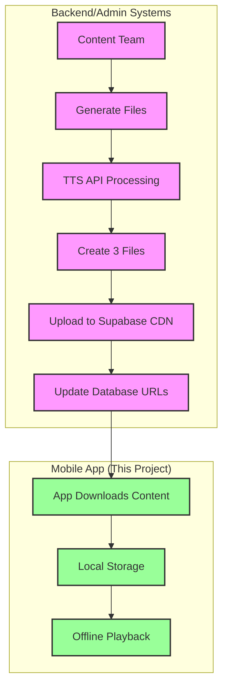

# Download App Data Configuration Guide

## ⚠️ IMPORTANT: Content Upload is NOT Part of the Mobile App

**This document describes backend/admin processes for content preparation.**
- **Mobile App Role:** Downloads and plays pre-processed content only
- **Backend/Admin Role:** Generates content files and uploads to Supabase CDN
- **Upload Scripts:** For admin/backend use only, not included in mobile app
- **CDN Management:** Handled by content team or automated backend pipeline

## Overview

This document describes the data preprocessing pipeline for converting TTS API responses into the download-first architecture format. It covers JSON schemas, data extraction processes, and the transformation from streaming API responses to pre-processed static files that are uploaded to Supabase CDN for mobile app consumption.

## Table of Contents
1. [File Structure](#file-structure)
2. [JSON Schemas](#json-schemas)
3. [Data Processing Pipeline](#data-processing-pipeline)
4. [Speechify API Integration](#speechify-api-integration)
5. [Sentence Chunking Algorithm](#sentence-chunking-algorithm)
6. [Implementation Scripts](#implementation-scripts)
7. [Testing & Validation](#testing--validation)

## File Structure

Each learning object requires three files stored in a standardized directory structure:

```
assets/test_content/learning_objects/{learning_object_id}/
├── audio.mp3       # Pre-generated audio file (~1MB per minute)
├── content.json    # Display text and metadata (~1-10KB)
└── timing.json     # Word and sentence timing data (~5-50KB)
```

### File Sizes
- **Audio:** ~1MB per minute of speech (MP3 format, 48kbps)
- **Content:** 1-10KB depending on text length
- **Timing:** ~100 bytes per word (includes timestamps and positions)

## JSON Schemas

### 1. Content File Schema (content.json)

```json
{
  "$schema": "http://json-schema.org/draft-07/schema#",
  "type": "object",
  "required": ["version", "displayText", "paragraphs", "metadata"],
  "properties": {
    "version": {
      "type": "string",
      "description": "Schema version for future compatibility",
      "const": "1.0"
    },
    "displayText": {
      "type": "string",
      "description": "Complete formatted text for display"
    },
    "paragraphs": {
      "type": "array",
      "description": "Text broken into paragraphs for better rendering",
      "items": {
        "type": "string"
      }
    },
    "metadata": {
      "type": "object",
      "properties": {
        "wordCount": {"type": "integer"},
        "characterCount": {"type": "integer"},
        "estimatedReadingTime": {"type": "string"},
        "language": {"type": "string", "default": "en"}
      }
    }
  }
}
```

### 2. Timing File Schema (timing.json)

```json
{
  "$schema": "http://json-schema.org/draft-07/schema#",
  "type": "object",
  "required": ["version", "words", "sentences", "totalDurationMs"],
  "properties": {
    "version": {
      "type": "string",
      "const": "1.0"
    },
    "words": {
      "type": "array",
      "description": "Individual word timing data",
      "items": {
        "type": "object",
        "required": ["word", "startMs", "endMs", "charStart", "charEnd"],
        "properties": {
          "word": {"type": "string"},
          "startMs": {"type": "integer", "description": "Start time in milliseconds"},
          "endMs": {"type": "integer", "description": "End time in milliseconds"},
          "charStart": {"type": "integer", "description": "Start position in displayText"},
          "charEnd": {"type": "integer", "description": "End position in displayText"}
        }
      }
    },
    "sentences": {
      "type": "array",
      "description": "Pre-processed sentence boundaries",
      "items": {
        "type": "object",
        "required": ["text", "startMs", "endMs", "wordStartIndex", "wordEndIndex"],
        "properties": {
          "text": {"type": "string"},
          "startMs": {"type": "integer"},
          "endMs": {"type": "integer"},
          "wordStartIndex": {"type": "integer", "description": "Index in words array"},
          "wordEndIndex": {"type": "integer", "description": "Index in words array (inclusive)"},
          "charStart": {"type": "integer"},
          "charEnd": {"type": "integer"}
        }
      }
    },
    "totalDurationMs": {"type": "integer", "description": "Total audio duration"}
  }
}
```

## Data Processing Pipeline

### Step 1: Text Preparation
1. Extract plain text from source content (remove SSML tags if present)
2. Identify paragraph boundaries (double newlines or explicit paragraph markers)
3. Clean and normalize text (remove extra whitespace, fix encoding issues)

### Step 2: TTS Generation
1. Send text to Speechify API with `include_speech_marks: true`
2. Receive base64-encoded audio and timing metadata
3. Decode audio to binary MP3 format

### Step 3: Timing Extraction
1. Parse speech marks from API response
2. Extract word-level timing information
3. Calculate sentence boundaries
4. Map character positions to display text

### Step 4: File Generation
1. Save MP3 audio file
2. Create content.json with text and metadata
3. Generate timing.json with processed timing data

## Speechify API Integration

### API Request Configuration

```python
payload = {
    'input': text_content,
    'voice_id': 'henry',  # Or other available voice
    'model': 'simba-turbo',
    'speed': 1.0,
    'include_speech_marks': True,  # CRITICAL: Required for timing data
}
```

### API Response Structure

The Speechify API returns a nested structure:

```json
{
  "audio_data": "base64_encoded_mp3_data...",
  "speech_marks": {
    "type": "sentence",
    "start": 0,
    "end": 451,
    "start_time": 0,
    "end_time": 26325,
    "value": "full_text_without_punctuation",
    "chunks": [
      {
        "type": "word",
        "start": 0,
        "end": 13,
        "start_time": 0,
        "end_time": 1280,
        "value": "Understanding"
      },
      // ... more word chunks
    ]
  }
}
```

### Extracting Word Timings

```python
words = []
if 'speech_marks' in data and isinstance(data['speech_marks'], dict):
    speech_data = data['speech_marks']

    # Extract words from chunks
    if 'chunks' in speech_data:
        for chunk in speech_data['chunks']:
            if chunk.get('type') == 'word':
                # Skip punctuation-only "words"
                if chunk['value'] not in [',', '.', '!', '?']:
                    words.append({
                        'word': chunk['value'],
                        'startMs': chunk['start_time'],
                        'endMs': chunk['end_time'],
                        'charStart': chunk['start'],
                        'charEnd': chunk['end']
                    })
```

## Sentence Chunking Algorithm

### Pre-Processing Approach

Instead of runtime sentence detection (350ms pause + punctuation), we pre-process sentences during file generation:

```python
def process_sentences(text, words):
    """
    Map pre-defined sentences to word indices.
    This replaces runtime sentence detection.
    """
    # Split text into sentences using punctuation
    sentence_texts = split_into_sentences(text)

    sentences = []
    word_idx = 0

    for sent_text in sentence_texts:
        sent_words = len(sent_text.split())

        if word_idx < len(words):
            start_idx = word_idx
            end_idx = min(word_idx + sent_words - 1, len(words) - 1)

            sentences.append({
                'text': sent_text,
                'startMs': words[start_idx]['startMs'],
                'endMs': words[end_idx]['endMs'],
                'wordStartIndex': start_idx,
                'wordEndIndex': end_idx,
                'charStart': text.find(sent_text),
                'charEnd': text.find(sent_text) + len(sent_text),
            })

            word_idx = end_idx + 1

    return sentences
```

### Benefits of Pre-Processing
1. **Eliminates runtime computation** - No 350ms pause detection needed
2. **Consistent results** - Same sentence boundaries every time
3. **Simplified client code** - Just reads pre-computed data
4. **Better performance** - No runtime sentence detection algorithms

## Implementation Scripts (Backend/Admin Only)

**⚠️ These scripts run on backend servers or admin systems, NOT in the mobile app**

### 1. Generate Test Content (generate_test_content.py)

**Purpose:** Backend script to create content files from Speechify API
**Location:** Backend server or admin workstation
**Usage:** Run during content preparation phase

```bash
python3 scripts/generate_test_content.py
```

**Output:**
- `audio.mp3` - Audio file from TTS
- `content.json` - Text and metadata
- `timing.json` - Word/sentence timings
- `raw_response.json` - Debug file with full API response

### 2. Extract Timing Data (extract_timing_data.py)

**Purpose:** Backend script to process API responses
**Location:** Backend server or admin workstation

```bash
python3 scripts/extract_timing_data.py
```

### 3. Production Pipeline (Backend Service)

**This runs on backend servers, NOT in the mobile app:**
1. Fetch learning object text from database
2. Call TTS API with batching for efficiency
3. Process and store files in Supabase CDN
4. Update database with file URLs
5. Mobile app downloads content when needed

## Testing & Validation

### Validation Checklist

#### Audio File
- [ ] MP3 format is valid
- [ ] Duration matches totalDurationMs
- [ ] File size is reasonable (~1MB/minute)

#### Content.json
- [ ] Schema version is "1.0"
- [ ] displayText matches source
- [ ] Paragraphs array is properly split
- [ ] Word count is accurate
- [ ] Character positions are correct

#### Timing.json
- [ ] All words have valid timestamps
- [ ] Word timestamps are sequential (no overlaps)
- [ ] Sentence boundaries cover all words
- [ ] Character positions map correctly to displayText
- [ ] totalDurationMs matches audio file

### Test Coverage

1. **Short content** (30 seconds, ~100 words)
2. **Medium content** (2 minutes, ~350 words)
3. **Full lesson** (5+ minutes, ~1000 words)

### Performance Metrics

- **File generation time:** <5 seconds per learning object
- **Storage requirements:** ~3-4MB per learning object
- **Download time (4G):** <10 seconds per learning object
- **Parse time (client):** <100ms for timing.json

## Migration from Streaming to Download-First

### Current State (Streaming)
```
Client → API Request → TTS Generation → Stream Audio → Runtime Processing
```

### New State (Download-First)
```
Pre-process → Store Files → Client Downloads → Local Playback
```

### Migration Steps
1. Generate files for all existing content
2. Upload to CDN/Storage
3. Update client to check for local files first
4. Fall back to streaming if files unavailable
5. Remove streaming code after full migration

## Supabase CDN Upload Process (Backend/Admin)

### Overview
Content files are uploaded to Supabase Storage for global CDN distribution. **This entire process happens OUTSIDE the mobile app** as part of the backend content preparation pipeline.

### Upload Workflow Separation



### Storage Bucket Configuration

Three public buckets are configured in Supabase:

| Bucket | Purpose | File Type | Size Limit |
|--------|---------|-----------|------------|
| `course-audio` | Audio files | MP3 | 50MB |
| `course-content` | Text content | JSON | 10MB |
| `course-timing` | Timing data | JSON | 5MB |

### CDN URL Structure

Files follow this URL pattern:
```
https://[project-id].supabase.co/storage/v1/object/public/[bucket]/[course-id]/[learning-object-id]/[filename]
```

Example:
```
https://cmjdciktvfxiyapdseqn.supabase.co/storage/v1/object/public/course-audio/INS-101/63ad7b78-0970-4265-a4fe-51f3fee39d5f/audio.mp3
```

### Upload Process (Backend/Admin Systems Only)

**⚠️ None of these steps happen in the mobile app**

1. **Generate Content Files (Backend Server)**
   ```bash
   # Run on backend server or admin workstation
   python3 scripts/generate_test_content.py
   ```

2. **Upload to Supabase Storage (Admin Tool)**
   - **Option A:** Use Supabase Dashboard for manual uploads
   - **Option B:** Use backend script with service role key (NEVER expose in mobile app):
   ```javascript
   await supabase.storage
     .from('course-audio')
     .upload(`${courseId}/${learningObjectId}/audio.mp3`, audioFile, {
       contentType: 'audio/mpeg',
       cacheControl: '2592000', // 30 days
       upsert: true
     });
   ```

3. **Update Database**
   ```sql
   UPDATE learning_objects
   SET
     audio_url = 'https://[project-id].supabase.co/storage/v1/object/public/course-audio/...',
     content_url = 'https://[project-id].supabase.co/storage/v1/object/public/course-content/...',
     timing_url = 'https://[project-id].supabase.co/storage/v1/object/public/course-timing/...',
     download_status = 'pending',
     file_version = 1,
     file_size_bytes = [total_size]
   WHERE id = '[learning-object-id]';
   ```

### Upload Requirements

#### File Naming Convention
- `audio.mp3` - Audio file
- `content.json` - Content text and metadata
- `timing.json` - Word and sentence timing data

#### Cache Control Headers
- Set to 30 days (2592000 seconds) for static content
- Ensures optimal CDN caching

#### Content Type Headers
- `audio/mpeg` for MP3 files
- `application/json` for JSON files

### CDN Benefits
- **Global Edge Caching**: Files cached at locations worldwide
- **Smart CDN** (Pro Plan): Automatic cache invalidation on updates
- **Cost Optimization**: $0.03/GB cached vs $0.09/GB uncached
- **Direct Public URLs**: No authentication overhead for downloads

### Production Upload Pipeline


### Critical Architecture Notes

#### What the Mobile App Does:
✅ Downloads pre-processed content from CDN
✅ Stores content locally for offline use
✅ Plays audio with synchronized highlighting
✅ Tracks download progress
✅ Manages local storage

#### What the Mobile App Does NOT Do:
❌ Generate audio from text
❌ Call TTS APIs directly
❌ Upload files to CDN
❌ Process timing data
❌ Create content files

#### Backend/Admin Responsibilities:
- Generate audio files via TTS APIs
- Process timing data
- Create JSON files
- Upload to Supabase CDN
- Update database with URLs
- Manage content versions

### Security Notes
- **Service Role Key:** NEVER include in mobile app
- **Upload Permissions:** Backend systems only
- **Public Buckets:** Read-only access for mobile app
- **Authentication:** Mobile app uses anon key for downloads

## Error Handling

### Common Issues and Solutions

1. **Missing speech marks in API response**
   - Ensure `include_speech_marks: true` in request
   - Check API version compatibility

2. **Character position misalignment**
   - Verify text encoding (UTF-8)
   - Handle special characters properly
   - Account for whitespace normalization

3. **Sentence boundary errors**
   - Pre-define sentence breaks in source
   - Handle abbreviations (Dr., Inc., etc.)
   - Consider language-specific rules

4. **Audio/timing sync issues**
   - Validate timestamps are monotonic
   - Check for gaps in timing data
   - Ensure audio duration matches timing

## Conclusion

This preprocessing pipeline transforms real-time TTS API responses into static files optimized for mobile delivery. By pre-computing sentence boundaries and word timings, we eliminate complex runtime processing while maintaining the same user experience with improved performance and offline capability.